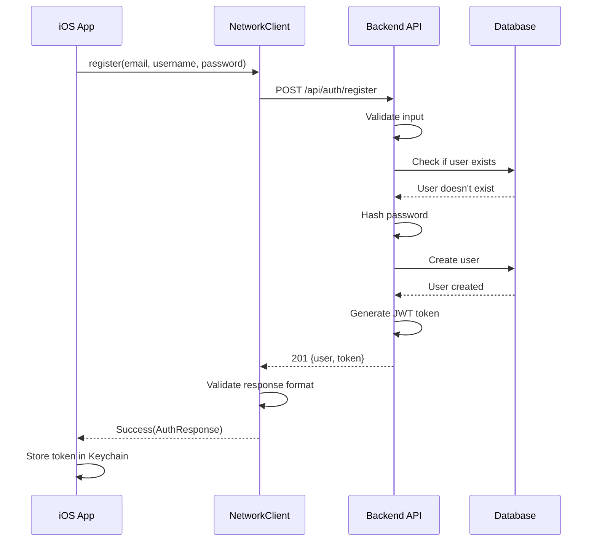
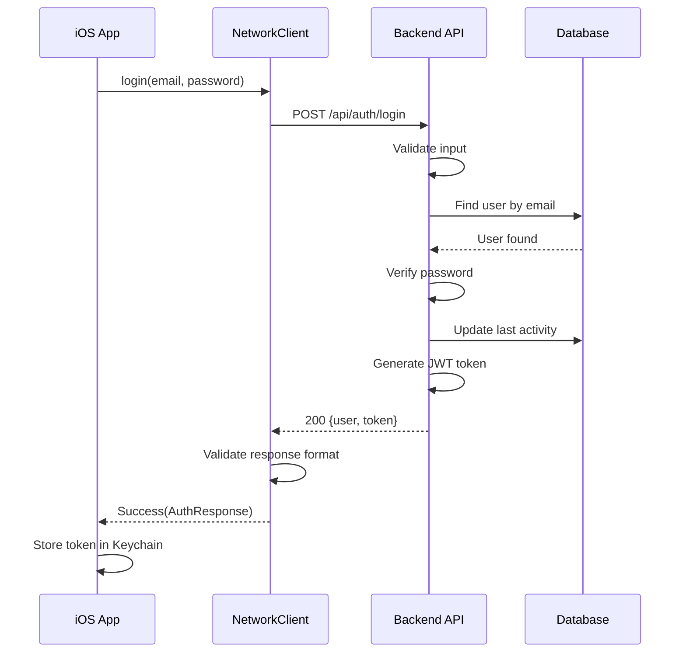
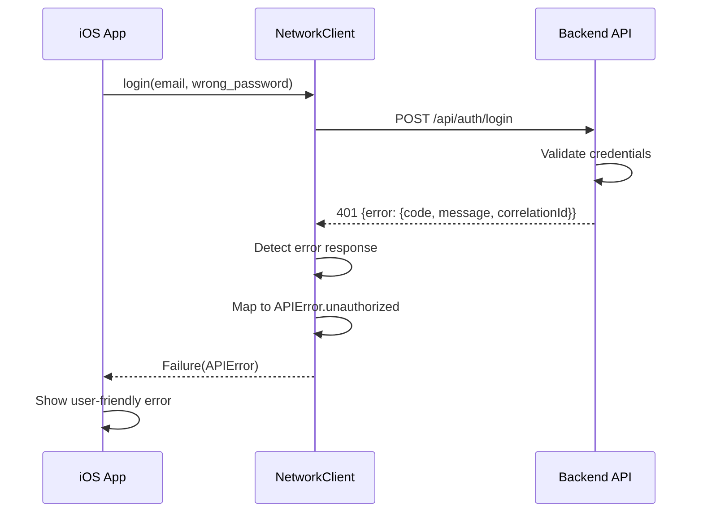

# Authentication Architecture Documentation

## Overview

This document describes the authentication architecture for the Perspective App, including the flow between iOS client and backend server, error handling patterns, and security considerations.

## System Components

### Backend Components

1. **AuthController** (`src/controllers/authController.ts`)
   - Handles authentication endpoints
   - Validates credentials
   - Generates JWT tokens
   - Implements comprehensive logging

2. **Authentication Middleware** (`src/middleware/auth.ts`)
   - Validates JWT tokens
   - Extracts user information from tokens
   - Protects authenticated routes

3. **Response Interceptor** (`src/middleware/responseInterceptor.ts`)
   - Ensures consistent error response format
   - Adds correlation IDs for request tracking
   - Transforms non-standard errors

4. **Validation Layer** (`src/validation/schemas/AuthSchemas.ts`)
   - Validates request payloads
   - Enforces strong password requirements
   - Prevents common security vulnerabilities

### iOS Components

1. **NetworkClient** (`ios/Perspective/Services/NetworkClient.swift`)
   - Handles HTTP communication
   - Validates responses before decoding
   - Maps backend errors to appropriate APIError cases

2. **AuthenticationService** (`ios/Perspective/Services/AuthenticationService.swift`)
   - Manages authentication state
   - Stores tokens securely in Keychain
   - Handles token refresh

3. **APIResponse** (`ios/Perspective/Services/APIResponse.swift`)
   - Type-safe response handling
   - Separates success and error cases
   - Provides consistent error mapping

## Authentication Flow

### Registration Flow



### Login Flow



### Error Handling Flow



## Error Response Format

All error responses follow this consistent structure:

```json
{
  "error": {
    "code": "ERROR_CODE",
    "message": "Human-readable error message",
    "correlationId": "unique-request-id",
    "validationErrors": [ // Optional, for validation errors
      {
        "field": "field.name",
        "message": "Field-specific error",
        "code": "VALIDATION_ERROR"
      }
    ]
  }
}
```

### Standard Error Codes

- `VALIDATION_ERROR` - Input validation failed
- `UNAUTHORIZED` - Missing or invalid authentication
- `FORBIDDEN` - Insufficient permissions
- `INVALID_CREDENTIALS` - Wrong username/password
- `USER_EXISTS` - Email/username already taken
- `NOT_FOUND` - Resource not found
- `RATE_LIMIT_EXCEEDED` - Too many requests
- `INTERNAL_ERROR` - Server error
- `MAINTENANCE_MODE` - Service unavailable

## Security Measures

### Password Requirements

- Minimum 8 characters
- High entropy (50+ bits)
- Must include uppercase, lowercase, numbers, and special characters
- Checked against common patterns
- Bcrypt hashing with 12 rounds

### Rate Limiting

- General API: 100 requests per 15 minutes
- Auth endpoints: 5 requests per 15 minutes
- Based on IP address
- Returns 429 with Retry-After header

### Token Security

- JWT tokens with 7-day expiration
- Stored in iOS Keychain (not UserDefaults)
- Token includes user ID, email, and username
- Plans for refresh token implementation

### Request Security

- CORS configured for allowed origins
- Helmet.js for security headers
- Request size limits
- SQL injection prevention via parameterized queries

## Logging and Monitoring

### Correlation IDs

Every request is assigned a correlation ID for tracking:
- Generated if not provided
- Included in all log entries
- Returned in error responses
- Added to response headers

### Structured Logging

```typescript
logger.info('Login attempt started', {
  correlationId: 'abc-123',
  email: 'user***@example.com', // Masked
  timestamp: '2025-06-02T21:00:00Z'
});
```

### Log Levels

- `error`: Authentication failures, system errors
- `warn`: Invalid attempts, rate limiting
- `info`: Successful operations
- `debug`: Detailed flow information

## Best Practices

### Backend

1. **Never log sensitive data** (passwords, full emails)
2. **Always validate input** before processing
3. **Use consistent error codes** for client handling
4. **Include correlation IDs** in all responses
5. **Mask PII in logs** (email, names)

### iOS Client

1. **Validate responses before decoding** to prevent crashes
2. **Store tokens securely** in Keychain
3. **Handle all error cases** gracefully
4. **Implement token refresh** before expiration
5. **Clear credentials on logout** completely

## Future Enhancements

1. **Refresh Tokens**
   - Implement refresh token flow
   - Automatic token renewal
   - Revocation support

2. **Two-Factor Authentication**
   - TOTP support
   - SMS fallback
   - Recovery codes

3. **OAuth Integration**
   - Expand beyond Google Sign-In
   - Apple Sign-In for iOS
   - GitHub/Twitter options

4. **Session Management**
   - Device tracking
   - Remote logout
   - Session history

5. **Enhanced Monitoring**
   - Failed login alerts
   - Suspicious activity detection
   - Geographic anomaly detection

## Migration Considerations

When updating authentication:

1. **Backward Compatibility**
   - Support old token formats temporarily
   - Gradual migration path
   - Clear deprecation timeline

2. **Database Changes**
   - Non-breaking schema updates
   - Data migration scripts
   - Rollback procedures

3. **Client Updates**
   - Feature flags for new auth
   - Graceful degradation
   - Force update mechanisms

## Testing

### Unit Tests
- Controller logic
- Middleware behavior
- Validation rules

### Integration Tests
- Full authentication flow
- Error scenarios
- Rate limiting

### End-to-End Tests
- iOS to backend flow
- Token lifecycle
- Error handling

## Troubleshooting

### Common Issues

1. **"Failed to authenticate user"**
   - Check server logs for specific error
   - Verify database connection
   - Ensure user exists

2. **Token decoding errors**
   - Verify JWT secret matches
   - Check token expiration
   - Ensure proper Bearer format

3. **Rate limiting**
   - Wait for Retry-After period
   - Check IP-based limits
   - Consider increasing limits

### Debug Tools

1. **Correlation ID tracking**
   ```bash
   grep "correlation-id-here" logs/all.log
   ```

2. **Authentication test script**
   ```bash
   node test-authentication-flow.js
   ```

3. **Database verification**
   ```sql
   SELECT id, email, username, created_at 
   FROM users 
   WHERE email = 'user@example.com';
   ```